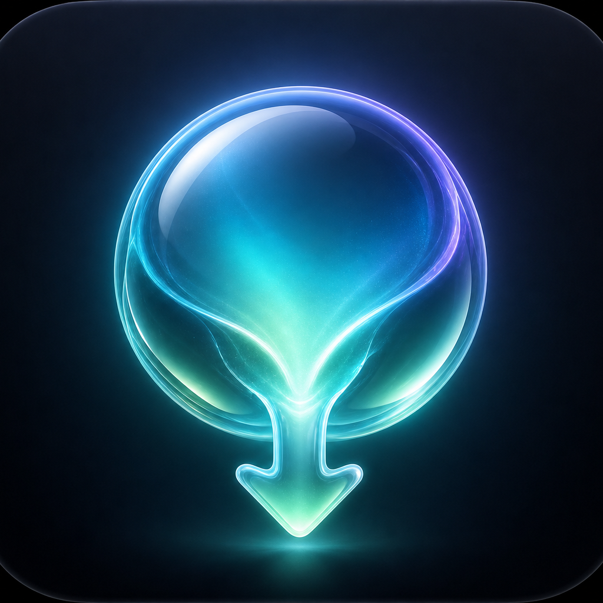

<div align="center">



# Lumen

**液态玻璃风格的桌面下载管理器 · macOS & Windows**
*A liquid‑glass download manager for macOS & Windows*

[](https://github.com/MageGojo/Lumen/releases)
[](https://github.com/MageGojo/Lumen/releases)
[](LICENSE)
[](https://flutter.dev)

</div>

---

## Lumen 是什么

**Lumen** 是一款现代化的桌面下载管理器,用 Flutter 打造液态玻璃(Liquid Glass)界面,内置 **Surge + aria2 双下载引擎**:

- **HTTP / 直链**:由 Surge 引擎多线程加速下载;
- **磁力 / BT 种子**:由 aria2 引擎处理(支持 DHT、做种);
- **短视频 / 图文分享链接**:自动解析为可下载的直链(解析能力由 [apizero.cn](https://apizero.cn) 提供);
- **浏览器下载接管**:配套 Chrome 扩展,像 IDM 一样接管浏览器里的每一个下载。

引擎全部**内置免安装**——下载即用,无需 `brew install` 或手动配置任何依赖。

> 一句话:把分散在「IDM + 迅雷 + 视频解析站 + aria2」里的事,装进一个干净好看、开箱即用的 App。

---

## ✨ 功能特性

| 能力 | 说明 |
| --- | --- |
| 🚀 多线程下载 | Surge 引擎多连接加速,实时速度 / 进度 / ETA |
| 🧲 磁力与种子 | 内置 aria2,支持 `magnet:` 与 `.torrent`,DHT / LPD |
| 🎬 视频 / 图文解析 | 粘贴分享链接自动解析多清晰度视频、图集、音频(基于 apizero.cn) |
| 🧩 浏览器接管 | Chrome 扩展接管浏览器下载,携带 Referer 绕过防盗链(IDM 同款) |
| 🪪 自定义 UA / 请求头 | 全局或单次设置 User‑Agent、Cookie、Authorization 等,攻克需要特定头才能下载的站点 |
| 🔁 重复下载检测 | 下载前探测目录是否已有同名 / 同大小文件,弹窗让你选择「跳过 / 改名 / 替换」 |
| 🗂 排序与筛选 | 按下载时间 / 名称排序,按状态筛选 |
| 🌗 深 / 浅色主题 | 冷调现代白 + 暗色 OLED,液态玻璃质感,跟随系统 |
| 📦 引擎内置 | Surge 与 aria2 随包分发,首启自动解压,无需任何额外安装 |

---

## 🌟 为什么选择 Lumen

- **真·开箱即用**:不像很多 aria2 前端需要你自己装 aria2、配 RPC、调端口——Lumen 把引擎打进了 App。
- **一个界面,多种来源**:直链、磁力、视频站分享链、浏览器接管,统一在一个队列里管理。
- **能下「下不动」的东西**:自定义 UA 与请求头,配合 Referer 透传,搞定防盗链 / 需要登录态 / 挑客户端的资源。
- **颜值在线**:液态玻璃 + 极光背景,深浅双主题,长期使用也舒服。
- **隐私友好**:本地优先,下载与解析都在你自己的机器上发起;解析接口可换成你自建的服务。

---

## 📦 下载安装

前往 **[Releases](https://github.com/MageGojo/Lumen/releases)** 下载:

- **macOS(Apple Silicon)**:`Lumen-macOS.dmg` —— 打开后把 Lumen 拖进「应用程序」。
  - 首次打开若提示「无法验证开发者」,在「系统设置 → 隐私与安全性」点「仍要打开」即可(应用未做公证)。
- **Windows**:`Lumen-Windows-Setup.exe`(或 `Lumen-Windows.zip` 解压即用)。

> macOS 版内置了完整的 Surge + aria2 引擎闭包,开箱即用。Windows 版目前为界面预览版,完整引擎内置见 [Roadmap](#-roadmap)。

---

## 🧩 浏览器扩展(下载接管)

仓库内 `browser_extension/` 是一个 MV3 Chrome 扩展,可像 IDM 一样**接管浏览器的所有下载**并交给 Lumen 多线程下载:

1. 打开 Lumen(会在本地 `http://127.0.0.1:8787` 起一个回环桥);
2. Chrome 打开 `chrome://extensions` → 开启「开发者模式」→「加载已解压的扩展程序」→ 选择 `browser_extension` 目录;
3. 之后浏览器里的下载会自动被接管。也可在 Lumen「设置 → 浏览器扩展」里一键安装。

---

## 🪪 自定义 UA 与请求头

有些站点必须带特定 `User-Agent` 或 `Cookie / Authorization / Referer` 才能下载。Lumen 支持两个层级:

- **全局默认**:`设置 → 下载请求(UA / 请求头)`,对所有直链下载生效;
- **单次覆盖**:下载栏点 `⚙️ 高级`,只对这一次下载生效。

> 当设置了自定义 UA / 请求头时,该下载会自动走 aria2 引擎(它能携带任意请求头)。

---

## 🎬 视频 / 图文解析

把短视频、图文的**分享链接**粘进下载栏,Lumen 会自动识别并解析为可下载的多清晰度视频 / 图集 / 音频。

解析能力由 **[apizero.cn](https://apizero.cn)** 的开放 API 提供。在 `设置 → Apizero 解析` 填入你自己的 API Key 即可使用,也可以把解析接口换成兼容的自建服务。

---

## 🛠 从源码构建

需要 [Flutter](https://flutter.dev)(3.4+)。

```bash
git clone https://github.com/MageGojo/Lumen.git
cd Lumen
flutter pub get

# 运行
flutter run -d macos        # 或 -d windows

# 打包
flutter build macos --release
flutter build windows --release
```

重新生成应用图标(改了 `assets/icon/lumen.png` 后):

```bash
dart run flutter_launcher_icons
```

---

## 🏗 技术栈

- **UI**:Flutter(自绘液态玻璃组件 + flutter_acrylic 原生毛玻璃)
- **HTTP 引擎**:[Surge](https://github.com/SurgeDM/Surge)(Go)
- **BT 引擎**:[aria2](https://github.com/aria2/aria2)
- **解析**:[apizero.cn](https://apizero.cn) API
- **状态管理**:provider · 自适应轮询

---

## 🗺 Roadmap

- [ ] Windows 引擎内置(随包分发 surge.exe / aria2c.exe)
- [ ] HLS(`.m3u8`)/ DASH 切片合并下载(接 ffmpeg)
- [ ] macOS 公证签名 / Intel(x86_64)构建
- [ ] SSE 事件流替代轮询,进一步降功耗
- [ ] 拖拽链接 / 本地 `.torrent` 拖入

有想要的功能或遇到 Bug?欢迎到 **[Issues](https://github.com/MageGojo/Lumen/issues)** 反馈。

---

## 🐛 反馈与贡献

- **Bug / 需求**:提 [Issue](https://github.com/MageGojo/Lumen/issues)(已内置 Bug / Feature 模板)。
- **PR**:欢迎,提交前请确保 `flutter analyze` 无问题。

---

## 📄 许可与致谢

本项目代码以 [MIT](LICENSE) 许可开源。随包分发的第三方引擎遵循各自许可:

- **Surge** —— 见其上游仓库许可;
- **aria2** —— GPLv2(以未修改的上游二进制形式分发);
- 视频 / 图文解析能力由 **[apizero.cn](https://apizero.cn)** 提供。

感谢以上项目与服务。
